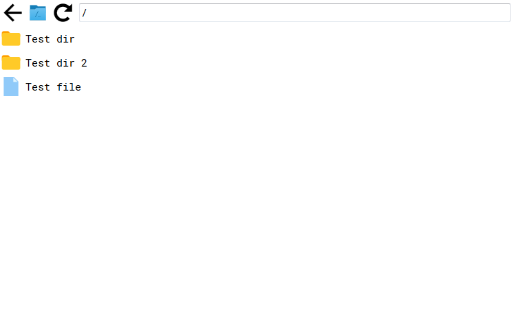

# easy-file-manager
React based File Manager for browser
## Install
Dependency Installation:
```
cd easy-file-manager-backend
npm install
cd ../easy-file-manager-app
npm install
```
Сonfiguration:
In the file **easy-file-manager-backend/config.json** specify the path to the root directory.
## Start
```
cd easy-file-manager-backend
node bin/www
```
Open a new terminal and
```
cd easy-file-manager-app
npm start
```
Open http://127.0.0.1:3000
